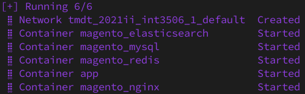

# tmdt_2021II_INT3506_1
Dự án thương mại điện tử


## Một số yêu cầu về phần cài đặt

- [Docker](https://docs.docker.com/engine/install)
- [Docker-compose](https://docs.docker.com/compose/)
- [PHP](https://www.php.net/)
- [Composer](https://getcomposer.org/)


## Docker

Các service mà sử dụng trong docker

    nginx
    php7.4-fpm
    mysql
    redis
    elasticsearch

Build docker bằng lệnh

```bash
docker-compose up -d --build
```

Chờ đợi docker-compose tải và cài đặt lại các container đến khi có kết quả như sau:




Để có thể truy cập **containter app** thì dùng lệnh sau

```bash
docker exec -it app bash
```

Tắt docker:
```bash
docker-compose down
```
